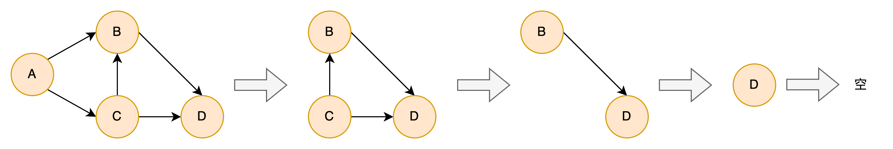
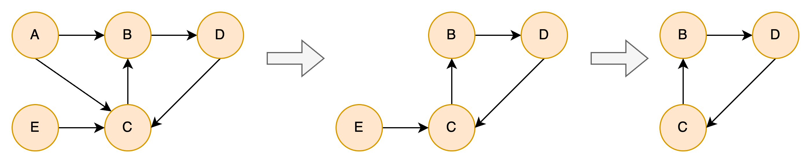

# Rocket启动框架

Rocket是一个使用有向图和协程实现的Android异步启动框架，它可以解决复杂的任务依赖和并发问题，可随时监听一个或多个任务的运行状态，充分利用了协程的便利性，实现了无callback设计，是目前与协程结合最好的启动框架之一。

### 一、功能比较

|        | Rocket | Alpha | Anchors | AndroidStartup |
|:-------|:------:|:-----:|:-------:|:--------------:|
| 依赖支持 | ✅ | ✅ | ✅ | ✅ |
| 循环依赖检测 | ✅ | ❌ | ✅ | ✅ |
| 线程控制 | 每个任务可指定线程 | ❌ | 同步或异步 | 是否运行在主线程 |
| 同步等待 | 单个、多个、全部任务 | 全部任务 | 单个、全部任务 | 全部任务 |
| 结束通知方式 | 协程挂起&恢复 | callback | callback | callback |
| 多进程 | ❌ | ✅ | ✅ | ✅ |

### 二、使用指南

1. 实现自己的Task类。继承Task，在run()方法中实现该Task需要做的事情。
   ```kotlin
	class SampleTask : Task() {
	    override fun run() {
	        println("${this::class.simpleName}")
	        // todo
	    }
	}
   ```

2. 构建依赖图。
   ```kotlin
    /**
     * 例如构建以下任务依赖关系
     *
     * a(IO)    b(Main)   c        d       e
     * |        |         |        |       |
     * +------- f         |        |       k
     * |        |         |        |
     * +------- g --------+        |
     * |                           |
     * +------------- h(Main)------+
     *                |
     *          +-----+-----+
     *          |           |
     *          i           j
     */

	val a = ATask()
	val b = BTask()
	val c = CTask()
	val d = DTask()
	val e = ETask()
	val f = FTask()
	val g = GTask()
	val h = HTask()
	val i = ITask()
	val j = JTask()
	val k = KTask()

    val map = TaskMap()
    map.add(a, Dispatchers.IO) // a运行在io线程池
    map.add(b, Dispatchers.Main) // b运行在主线程
    map.add(c)
    map.add(d)
    map.add(e)
    map.add(f, a, b) // f依赖a、b
    map.add(g, a, c, f) // g依赖a、c、f
    map.add(h, Dispatchers.Main, a, d) // h执行在主线程，依赖a、d
    map.add(i, h) // i依赖h
    map.add(j, h) // j依赖h
    map.add(k, e) // k依赖e
   ```

3. 执行任务。

   调用`TaskLauncher.start`执行任务：
   ```kotlin
	val launcher = TaskLauncher.start(GlobalScope, map) // 不会阻塞线程
   ```
   也可以使用协程挂起方式执行任务：
   ```kotlin
	GlobalScope.launch(Dispatchers.IO) {
		TaskLauncher.start(map) // 挂起
		// 运行到这里时，所有任务已执行完成
	}
   ```
   或者阻塞方式执行任务：
   ```kotlin
	runBlocking {
		TaskLauncher.start(map)
	}
	// 运行到这里时，所有任务已执行完成
   ```

4. 等待任务完成或查询任务执行状态。

   除了在`TaskLauncher.start`时挂起等待任务执行完成，还可以使用`fun start(scope: CoroutineScope, map: TaskMap): TaskLauncher`的返回值等待任务执行或查询执行状态。
   ```kotlin
	val launcher = TaskLauncher.start(GlobalScope, map) // 不会阻塞线程

	// 查询任务执行状态
	val isCompleted = launcher.isCompleted()

	// 阻塞等待所有任务执行完成
	runBlocking {
		launcher.await()
	}
   ```

   如要查询某几个任务的执行状态，则需要在构建依赖图时设置`TaskTag`，再通过`TaskLauncher`对象查询。
   ```kotlin
    val map = TaskMap()
    map.add(a, "taskA") // 设置任务a的TaskTag是taskA
    map.add(b)
    map.add(c)
    map.add(d, "taskD", b, c)

	val launcher = TaskLauncher.start(GlobalScope, map)

	// 查询a、d任务执行状态
	val isCompleted = launcher.isTaskCompleted("taskA", "taskD")

	// 阻塞等待a、d任务执行完成
	runBlocking {
		launcher.awaitTask("taskA", "taskD")
	}
   ```

### 三、有向图是否存在环的检测原理

循环删除有向图中入度为0的节点，直到不能删除为止，最后图中节点数为0则不存在环，否则存在。（PS：调用`TaskLauncher.start`时会自动检测是否存在环，无需额外处理）

1. 无环判断过程。

   |     | 入度 | 出度 |
   |:---:|:------:|:-----:|
   |  A  | 0 | 2（B、C） |
   |  B  | 2（A、C） | 1（D） |
   |  C  | 1（A） | 2（B、D） |
   |  D  | 2（B、C） | 0 |

   

2. 有环判断过程。

   |     | 入度 | 出度 |
   |:---:|:------:|:-----:|
   |  A  | 0 | 2（B、C） |
   |  B  | 2（A、C） | 1（D） |
   |  C  | 3（A、D、E）） | 1（B） |
   |  D  | 1（B） | 1（C） |
   |  E  | 0 | 1（C） |

   

### 四、Q&A

1. 为什么不支持多进程。

   其实并不是不支持多进程，只是多进程处理可以放在框架外进行，一般情况下各个进程需要执行的任务差异较大，所以感觉没必要把不同进程的任务耦合在一起，我建议先判断进程，再根据不同的进程构建各自的任务依赖图，这样后续维护也简单清晰，如果各进程的任务差异较少，也可以在构建依赖图时判断进程添加不同的任务。

2. Rocket框架性能如何。

   跟Alpha框架比较，测试20个任务以同样的依赖图运行，使用release包，测试手机是Pixel 5（CPU：高通骁龙765G）。在任务执行效率方面，总时间较Alpha框架慢5-10ms，这是由于大量使用协程`Job#join`导致的，协程挂起再恢复的效率不如线程池循环拉取任务的效率高（Kotlin-JVM协程本质上是Java Thread API的封装和抽象，它提供了一种更高级别的抽象，使得在程序中处理异步任务和并发编程更加简单和优雅，协程跟线程池比较没什么性能优势）。在阻塞等待任务执行方面，CPU占用较Alpha框架低2-3%，Rocket框架使用协程挂起实现等待，而Alpha框架是循环调用`Object#wait`方法实现等待，所以阻塞等待效率略好于Alpha框架。Rocket框架的性能各有优劣，但它胜在与协程结合得好，在任务状态查询、阻塞等待等场合能让代码简单很多。
